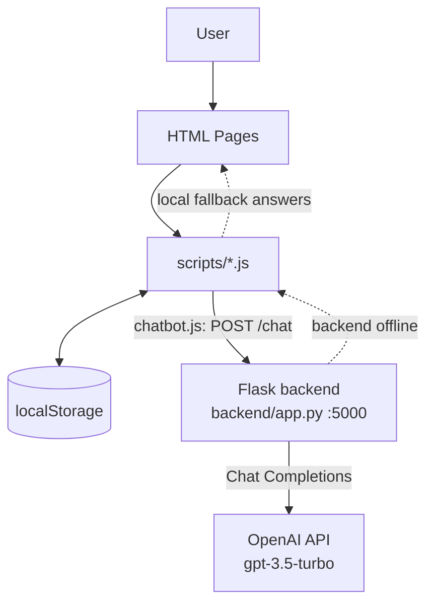

# 🏗️ EduBridge — Project Architecture

This document explains **how EduBridge is put together**: the high-level design,
the repository layout, how data flows through the app, and what each module is
responsible for. It is meant to get a new contributor productive quickly.

> New here? Read the [README](README.md) first for setup, then come back for the
> "how it works" picture.

---

## 1. High-Level Overview

EduBridge is a **multi-page web application** with a lightweight AI chatbot.

- The **frontend** is plain HTML + CSS + vanilla JavaScript. There is **no build
  step and no framework** — pages are served/opened as static files.
- Almost all app state (users, sessions, quizzes, curated content, theme) lives
  in the **browser's `localStorage`**. There is currently **no database**.
- The only server-side piece is a small **Flask backend** that proxies chat
  messages to the **OpenAI API**. The chatbot works with or without it (it falls
  back to canned local answers when the backend is offline).

```
                    ┌──────────────────────────────────────────┐
                    │                Browser                     │
                    │                                            │
   User ───────────►  HTML pages  ──loads──►  scripts/*.js       │
                    │  (index, quiz,          (UI + logic)       │
                    │   login, admin, …)          │              │
                    │                             ▼              │
                    │                    localStorage            │
                    │           (users, quizzes, content, theme) │
                    │                             │              │
                    │        chatbot.js ──────────┘              │
                    └──────────────┬─────────────────────────────┘
                                   │ POST /chat  (only for AI chat)
                                   ▼
                    ┌──────────────────────────────┐
                    │  Flask backend (backend/app.py)│
                    │  http://127.0.0.1:5000/chat    │
                    └──────────────┬─────────────────┘
                                   │ Chat Completions
                                   ▼
                    ┌──────────────────────────────┐
                    │        OpenAI API             │
                    │      (gpt-3.5-turbo)          │
                    └──────────────────────────────┘
```

<details>
<summary>Same diagram in Mermaid (renders on GitHub)</summary>


</details>

---

## 2. Technology Stack

| Layer      | Technology                                             |
|------------|--------------------------------------------------------|
| Frontend   | HTML5, CSS3, Vanilla JavaScript (ES6), Font Awesome, AOS |
| Backend    | Python 3, Flask, Flask-CORS                            |
| AI         | OpenAI API (`gpt-3.5-turbo`)                           |
| Storage    | Browser `localStorage` (no external database)         |
| Config     | `.env` via `python-dotenv` (`OPENAI_API_KEY`)         |

---

## 3. Repository Structure

```
EduBridge/
├── *.html                  # Top-level pages (see Page Inventory below)
├── Styles/                 # CSS, one file per feature area
│   ├── main.css            # Global layout, nav, cards, hero
│   ├── auth.css            # Login / register
│   ├── profile.css         # Profile page
│   ├── quiz.css            # Quiz UI
│   ├── chat.css            # Chatbot widget
│   └── admin.css           # Admin dashboard
├── scripts/                # All frontend JavaScript (see Module Guide)
│   ├── main.js             # Nav, auth-state UI, page bootstrapping
│   ├── auth.js             # Auth + user store (localStorage)
│   ├── theme.js            # Light/dark theme switching
│   ├── chatbot.js          # Chat widget + hybrid remote/local logic
│   ├── content.js          # Renders curated content grids
│   ├── content-data.js     # Default content seed data
│   ├── quiz.js             # Quiz engine (timer, scoring, flow)
│   ├── quiz-data.js        # Default quiz questions seed data
│   └── admin.js            # Admin dashboard CRUD (content/quizzes/users)
├── templates/
│   └── chatbot.html        # Chatbot widget markup (injected into pages)
├── backend/
│   ├── app.py              # ✅ ACTIVE Flask backend — /chat → OpenAI
│   └── app                 # ⚠️ Stray duplicate of app.py (safe to remove)
├── server/                 # ⚠️ Legacy/experimental Node servers (NOT wired up)
│   ├── server.js           #    Express :3000, old completions API, placeholder key
│   └── index.js            #    Express; requires missing ./chatbot (won't run as-is)
├── resources/              # Static study material (PDFs) + resource pages
├── assets/ , images/       # Media
├── package.json            # Node metadata (no active deps/scripts)
├── README.md               # Overview + setup
├── CONTRIBUTING.md
├── CODE_OF_CONDUCT.md
└── LICENSE
```

### Page Inventory

| Page                  | Purpose                          | Key scripts loaded                                   |
|-----------------------|----------------------------------|------------------------------------------------------|
| `index.html`          | Landing / home                   | `main.js`, `chatbot.js`, `auth.js`                   |
| `login.html`          | Sign in                          | `auth.js`                                            |
| `register.html`       | Sign up                          | `auth.js`                                            |
| `profile.html`        | User profile                     | `auth.js`                                            |
| `quiz.html`           | Take quizzes                     | `main.js`, `auth.js`, `quiz-data.js`, `quiz.js`     |
| `webdev.html`         | Web-dev learning track           | `main.js`, `auth.js`, `content-data.js`, `content.js`, `chatbot.js` |
| `ai.html`             | AI/ML learning track             | `main.js`, `auth.js`, `content-data.js`, `content.js` |
| `career.html`         | Career guidance track            | `main.js`, `auth.js`, `content-data.js`, `content.js` |
| `admin.html`          | Admin dashboard                  | `main.js`, `auth.js`, `content-data.js`, `quiz-data.js`, `admin.js` |
| `resources/*.html`    | Topic resource pages             | `chatbot.js`                                         |

---

## 4. Data Flow & Execution Pipeline

### 4.1 Page load & auth state
1. The browser opens an HTML page, which loads its scripts (see table above).
2. `main.js` runs `checkAuthState()`: reads `isLoggedIn` / `currentUser` from
   `localStorage` and swaps the nav between "Login/Register" and a profile menu.
   Admin links appear only when `currentUser.role === 'admin'`.
3. `theme.js` restores the saved theme (`localStorage.theme`).

### 4.2 Authentication (client-side, `auth.js`)
- **Register** → validates input, appends a user object to the `users` array in
  `localStorage`.
- **Login** → matches email/password against `users`, then sets `currentUser`
  and `isLoggedIn`.
- **Logout** → clears the session keys.

> ⚠️ Auth is **client-side only** (passwords stored in plain `localStorage`).
> It is a demo/learning implementation, **not** production-grade security.

### 4.3 Content grids (`content.js` + `content-data.js`)
- Pages with `[data-content-category]` grids call `loadContentItems()`.
- Data comes from `localStorage.adminContentItems`, seeded from
  `defaultContentItems` (`content-data.js`) on first run.
- Items are filtered by the grid's category (`webdev` / `ai` / `career` / `general`).

### 4.4 Quizzes (`quiz.js` + `quiz-data.js`)
- Quiz questions load from `localStorage.adminQuizzes`, seeded from
  `defaultQuizData` (`quiz-data.js`).
- `quiz.js` runs the engine: question navigation, a 60-second timer, option
  selection, scoring, and results.

### 4.5 Admin dashboard (`admin.js`)
- CRUD over the same `localStorage` keys used by the app
  (`adminContentItems`, `adminQuizzes`, `users`).
- Edits made here are what learners see on the content/quiz pages — the admin
  panel is effectively the app's "CMS", backed by `localStorage`.

### 4.6 Chatbot (`chatbot.js` — hybrid, this is the only server call)
1. The widget markup lives in `templates/chatbot.html`; `chatbot.js` wires it up.
2. On send, it **tries the backend first**:
   `POST http://127.0.0.1:5000/chat  { message }`.
3. **Backend online** → Flask calls OpenAI and returns `{ response }`, shown in chat.
4. **Backend offline / error** → it **falls back to local canned answers**
   (`getLocalResponse`) based on the current page context, so the widget always
   responds.

---

## 5. Backend (`backend/app.py`)

A minimal Flask service with a single endpoint:

| Method | Route   | Body                | Returns                          |
|--------|---------|---------------------|----------------------------------|
| POST   | `/chat` | `{ "message": str }`| `{ "response": str }` or `{ "error": str }` |

- Loads `OPENAI_API_KEY` from `.env` (`python-dotenv`).
- Enables CORS (frontend runs on a different origin/port).
- Calls OpenAI **Chat Completions** (`gpt-3.5-turbo`, `max_tokens=150`,
  `temperature=0.7`) with an EduBridge system prompt.
- Returns HTTP 500 if the key is missing, 400 if no message is provided.

Run it: `cd backend && python app.py` → serves `http://127.0.0.1:5000`.

---

## 6. Component Dependencies

- `main.js`, `content.js`, `quiz.js`, `admin.js` all depend on **`auth.js`**
  and the **`localStorage`** schema.
- `content.js` depends on `content-data.js`; `quiz.js` depends on `quiz-data.js`
  (the `*-data.js` files must be loaded **before** their consumers — see the page
  script order).
- `admin.js` reads/writes the **same keys** the rest of the app reads, so admin
  edits propagate to learner-facing pages.
- `chatbot.js` is the **only** module that talks to the backend; everything else
  is fully client-side.

### localStorage schema (shared contract)

| Key                  | Written by            | Read by                          |
|----------------------|-----------------------|----------------------------------|
| `users`              | `auth.js`, `admin.js` | `auth.js`, `admin.js`            |
| `currentUser`        | `auth.js`             | `main.js`, `admin.js`, pages     |
| `isLoggedIn`         | `auth.js`             | `main.js`                        |
| `adminContentItems`  | `content.js`, `admin.js` | `content.js`, `admin.js`      |
| `adminQuizzes`       | `quiz.js`, `admin.js` | `quiz.js`, `admin.js`            |
| `theme`              | `theme.js`            | `theme.js`                       |

---

## 7. Notes for Contributors

- **`server/` is not part of the running app.** `server/server.js` and
  `server/index.js` are earlier Node/Express experiments that are not wired to
  the frontend (`index.js` even requires a missing `./chatbot` module). The
  frontend chatbot targets the **Flask** backend on port `5000`. Treat `server/`
  as legacy until it is either finished or removed.
- **`backend/app`** is a stray duplicate of `backend/app.py`.
- There is **no build step** — edit a file and reload the page (a Live Server /
  local static server is recommended so `fetch` and relative paths behave).
- Because state is in `localStorage`, "reset the app" = clear site data in your
  browser dev tools.
